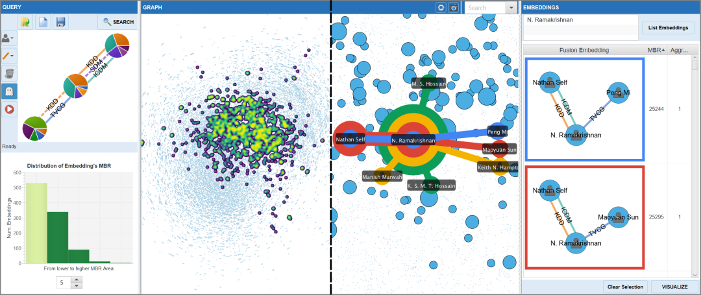

# VERTIGo: a Visual Platform for Querying and Exploring Large Multilayer Networks

Erick Cuenca, Arnaud Sallaberry, Dino Ienco, and Pascal Poncelet.



## Resume
Many real world data can be modeled by a graph with a set of nodes interconnected to each other by multiple relationships. Such a rich graph is called multilayer graph or network. Providing useful visualization tools to support the query process for such graphs is challenging. Although many approaches have addressed the visual query construction, few efforts have been done to provide a contextualized exploration of query results and suggestion strategies to refine the original query. This is due to several issues such as i) the size of the graphs ii) the large number of retrieved results and iii) the way they can be organized to facilitate their exploration. In this paper, we present VERTIGo, a novel visual platform to query, explore and support the analysis of large multilayer graphs. VERTIGo provides coordinated views to navigate and explore the large set of retrieved results at different granularity levels. In addition, the proposed system supports the refinement of the query by visual suggestions to guide the user through the exploration process. Two examples and a user study demonstrate how VERTIGo can be used to perform visual analysis (query, exploration, and suggestion) on real world multilayer networks.

**BibTex**
```
@article{cuenca2021vertigo,
  title={VERTIGo: a Visual Platform for Querying and Exploring Large Multilayer Networks},
  author={Cuenca, Erick and Sallaberry, Arnaud and Ienco, Dino and Poncelet, Pascal},
  journal={IEEE Transactions on Visualization and Computer Graphics},
  year={2021},
  publisher={IEEE},
  doi={10.1109/TVCG.2021.3067820}
  note={To appear}
}
```

## Keywords
Visual Querying System, Visual Pattern Suggestion, Multilayer Networks

## Programming language
Java

## Getting the code
The code is hosted at [Github](https://github.com/erickedu85/vertigo)

Get the last version of this approach with:

	$ git clone https://github.com/erickedu85/vertigo
	$ cd vertigo

## Run
Make sure to have installed the Java SE Development Kit (JDK) 1.8 in your machine.
The code of this paper has been tested in Windows 10
To run the application, you can double click on the vertigo.jar file

## Licence
[Attribution-NonCommercial-ShareAlike 4.0 International](https://creativecommons.org/licenses/by-nc-sa/4.0/ "Attribution-NonCommercial-ShareAlike 4.0 International")